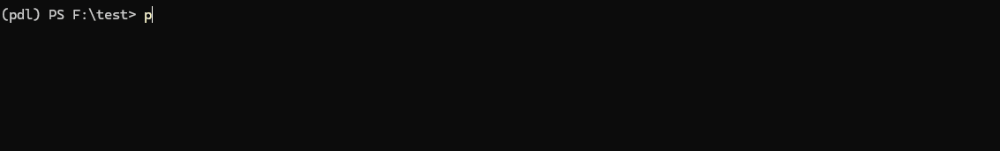
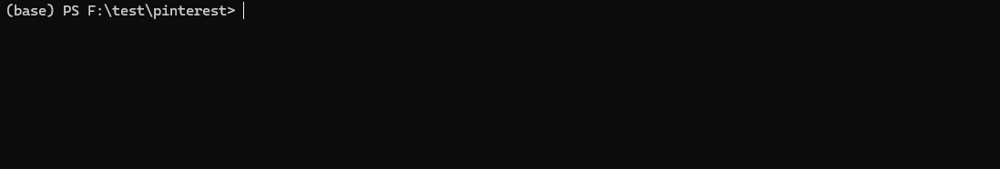
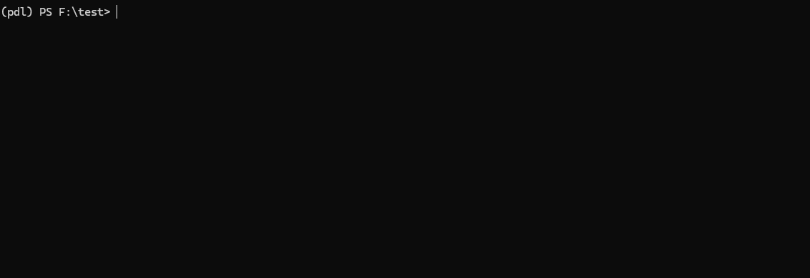

# Pinterest 媒体下载器 (pinterest-dl)
[](https://pypi.org/project/pinterest-dl/)
[](https://pypi.org/project/pinterest-dl/)
[](https://github.com/sean1832/pinterest-dl/blob/main/LICENSE)
[](https://pepy.tech/project/pinterest-dl)

<a href="https://www.buymeacoffee.com/zekezhang" target="_blank"></a>

**[English](README.md) | 中文**


本工具库用于从 [Pinterest](https://pinterest.com) 抓取和下载媒体内容（包括图片和视频流）。通过 [Selenium](https://selenium.dev) 和逆向工程的 Pinterest API 实现自动化，支持从指定 Pinterest URL 提取图片并保存到指定目录。

提供 [命令行工具](#-命令行使用) 直接使用，也支持 [Python API](#️-python-api) 编程调用。支持通过浏览器 cookies 获取私密画板和图钉中的媒体内容，并可将抓取的 URL 保存为 JSON 文件供后续使用。

> [!TIP]
> 如需图形界面版本，请查看 [pinterest-dl-gui](https://github.com/sean1832/pinterest-dl-gui)。
> 该工具基于同一核心库开发，提供了更友好的用户界面，也可作为将本库集成到 GUI 应用的参考示例。

> [!WARNING] 
> 本项目为独立开发，与 Pinterest 官方无关，仅用于学习目的。请注意自动化抓取可能违反 Pinterest [服务条款](https://developers.pinterest.com/terms/)。开发者不对工具滥用承担法律责任，请合理使用。

> [!NOTE]
> 本项目灵感来源于 [pinterest-image-scraper](https://github.com/xjdeng/pinterest-image-scraper)。

## 目录
- [Pinterest 媒体下载器 (pinterest-dl)](#pinterest-媒体下载器-pinterest-dl)
  - [目录](#目录)
  - [🌟 功能特性](#-功能特性)
  - [🚩 已知问题](#-已知问题)
  - [📋 环境要求](#-环境要求)
  - [📥 安装指南](#-安装指南)
    - [通过 pip 安装（推荐）](#通过-pip-安装推荐)
    - [从 GitHub 克隆](#从-github-克隆)
  - [🚀 命令行使用](#-命令行使用)
    - [通用命令结构](#通用命令结构)
    - [命令详解](#命令详解)
      - [1. 登录](#1-登录)
      - [2. 抓取](#2-抓取)
      - [3. 搜索](#3-搜索)
      - [4. 下载](#4-下载)
  - [🛠️ Python API](#️-python-api)
    - [1. 高级整合方法](#1-高级整合方法)
      - [1a. 使用 Cookies 抓取私密内容](#1a-使用-cookies-抓取私密内容)
    - [2. 底层控制方法](#2-底层控制方法)
      - [2a. 使用 API](#2a-使用-api)
        - [抓取媒体](#抓取媒体)
        - [搜索媒体](#搜索媒体)
      - [2b. 使用浏览器](#2b-使用浏览器)
  - [🤝 贡献指南](#-贡献指南)
  - [📜 许可证](#-许可证)

## 🌟 功能特性
- ✅ 直接从 Pinterest URL 抓取媒体
- ✅ 异步下载媒体文件（[#1](https://github.com/sean1832/pinterest-dl/pull/1)）
- ✅ 将抓取结果保存为 JSON 文件
- ✅ 无痕模式保护隐私
- ✅ 详细日志输出便于调试
- ✅ 支持 Firefox 浏览器
- ✅ 将媒体 `alt` 文本作为元数据嵌入下载文件
- ✅ 可选将 `alt` 文本另存为单独文件（[#32](https://github.com/sean1832/pinterest-dl/pull/32)）
- ✅ 通过浏览器 cookies 访问私密内容（[#20](https://github.com/sean1832/pinterest-dl/pull/20)）
- ✅ 使用逆向工程 API 抓取（默认方式，可通过 `--client chrome/firefox` 切换为浏览器模式）（[#21](https://github.com/sean1832/pinterest-dl/pull/21)）
- ✅ 通过关键词搜索媒体（[#23](https://github.com/sean1832/pinterest-dl/pull/23)）
- ✅ 单命令支持多 URL 和多查询
- ✅ 支持从文件批量处理 URL 和查询
- ✅ 下载视频流（如可用）

## 🚩 已知问题
- 🔲 测试覆盖率不足
- 🔲 在 ~~Linux 和~~ Mac 上未充分测试，发现 bug 请提交 [Issue](https://github.com/sean1832/pinterest-dl/issues)

## 📋 环境要求
- Python 3.10 或更高版本
- （可选）Chrome 或 Firefox 浏览器

## 📥 安装指南

### 通过 pip 安装（推荐）
```bash
pip install pinterest-dl
```

### 从 GitHub 克隆
```bash
git clone https://github.com/sean1832/pinterest-dl.git
cd pinterest-dl
pip install .
```

## 🚀 命令行使用

### 通用命令结构
```bash
pinterest-dl [命令] [选项]
```

| 命令                  | 描述                        |
| --------------------- | --------------------------- |
| [`login`](#1-登录)    | 登录 Pinterest 获取 cookies |
| [`scrape`](#2-抓取)   | 从 URL 抓取媒体             |
| [`search`](#3-搜索)   | 通过关键词搜索媒体          |
| [`download`](#4-下载) | 从 JSON 文件下载媒体        |

---

### 命令详解

#### 1. 登录  
获取浏览器 cookies 用于访问私密内容。

```bash
pinterest-dl login [选项]
```


| 选项                        | 说明             | 默认值         |
| --------------------------- | ---------------- | -------------- |
| `-o`, `--output [文件]`     | cookies 保存路径 | `cookies.json` |
| `--client [chrome/firefox]` | 使用的浏览器类型 | `chrome`       |
| `--headful`                 | 显示浏览器窗口   | 无             |
| `--incognito`               | 启用无痕模式     | 无             |
| `--verbose`                 | 显示调试信息     | 无             |

> [!TIP]
> 执行后会提示输入 Pinterest 账号密码，成功登录后 cookies 将保存到指定文件。

---

#### 2. 抓取  
从单个/多个 URL 或文件列表抓取媒体。

```bash
# 单/多 URL：
pinterest-dl scrape <url1> <url2> …

# 从文件（每行一个URL）：
pinterest-dl scrape -f urls.txt [选项]
pinterest-dl scrape -f urls1.txt -f urls2.txt [选项]

# 从标准输入：
cat urls.txt | pinterest-dl scrape -f - [选项]
```


| 选项                                 | 说明                               | 默认值         |
| ------------------------------------ | ---------------------------------- | -------------- |
| `-f`, `--file [文件]`                | URL 列表文件路径（`-` 表示 stdin） | 无             |
| `<url>`                              | Pinterest URL                      | 必填           |
| `-o`, `--output [目录]`              | 保存目录（不指定则输出到 stdout）  | 无             |
| `-c`, `--cookies [文件]`             | cookies 文件路径                   | `cookies.json` |
| `-n`, `--num [数量]`                 | 最大下载数量                       | `100`          |
| `-r`, `--resolution [宽x高]`         | 最低分辨率（如 `512x512`）         | 无             |
| `--video`                            | 下载视频流（如可用）               | 无             |
| `--timeout [秒]`                     | 请求超时时间                       | `3`            |
| `--delay [秒]`                       | 请求间隔延迟                       | `0.2`          |
| `--cache [路径]`                     | 保存抓取结果到 JSON                | 无             |
| `--caption [txt/json/metadata/none]` | 标题保存格式                       | `none`         |
| `--ensure-cap`                       | 要求每张图都有 alt 文本            | 无             |
| `--client [api/chrome/firefox]`      | 抓取方式                           | `api`          |
| `--headful`                          | 显示浏览器窗口                     | 无             |
| `--incognito`                        | 无痕模式                           | 无             |
| `--verbose`                          | 调试输出                           | 无             |

---

#### 3. 搜索  
通过关键词搜索媒体（仅 API 模式支持）。

```bash
# 简单查询：
pinterest-dl search <关键词1> <关键词2> ... [选项]

# 从文件：
pinterest-dl search -f queries.txt [选项]
pinterest-dl search -f q1.txt -f q2.txt [选项]

# 从标准输入：
cat queries.txt | pinterest-dl search -f - [选项]
```



| 选项                         | 说明               | 默认值 |
| ---------------------------- | ------------------ | ------ |
| `-f`, `--file [文件]`        | 关键词列表文件路径 | 无     |
| `<query>`                    | 搜索关键词         | 必填   |
| （其他选项同 `scrape` 命令） |                    |        |

---

#### 4. 下载  
从缓存文件下载媒体。

```bash
pinterest-dl download <缓存.json> [选项]
```


| 选项                         | 说明       | 默认值           |
| ---------------------------- | ---------- | ---------------- |
| `-o`, `--output [目录]`      | 保存目录   | `./<json文件名>` |
| `-r`, `--resolution [宽x高]` | 最低分辨率 | 无               |
| `--verbose`                  | 调试输出   | 无               |

## 🛠️ Python API
可通过 `PinterestDL` 类在代码中直接调用功能。

### 1. 高级整合方法
一步完成抓取和下载。

```python
from pinterest_dl import PinterestDL

# 初始化并下载
images = PinterestDL.with_api(
    timeout=3,        # 请求超时（秒）
    verbose=False,    # 调试日志
    ensure_alt=True,  # 确保每张图都有alt文本
).scrape_and_download(
    url="https://www.pinterest.com/pin/1234567",  # Pinterest URL
    output_dir="images/art",  # 保存目录
    num=30,         # 最大数量
    download_streams=True,  # 下载视频流
    min_resolution=(512, 512),  # 最低分辨率
    cache_path="art.json",  # 缓存路径
    caption="txt",  # 标题格式：txt/json/metadata/none
    delay=0.4,      # 请求间隔
)
```

搜索并下载：
```python
images = PinterestDL.with_api().search_and_download(
    query="艺术",    # 搜索关键词
    # 其他参数同上
)
```

#### 1a. 使用 Cookies 抓取私密内容
**1. 获取 cookies**
```python
import os
import json
from pinterest_dl import PinterestDL

email = input("输入Pinterest邮箱: ")
password = os.getenv("PINTEREST_PASSWORD")

# 登录获取cookies
cookies = PinterestDL.with_browser(
    browser_type="chrome",
    headless=True,
).login(email, password).get_cookies(after_sec=7)

with open("cookies.json", "w") as f:
    json.dump(cookies, f, indent=4)
```

**2. 使用 cookies 抓取**
```python
import json
from pinterest_dl import PinterestDL

with open("cookies.json", "r") as f:
    cookies = json.load(f)

images = (
    PinterestDL.with_api()
    .with_cookies(cookies)
    .scrape_and_download(
        url="https://www.pinterest.com/pin/1234567",  # 私密URL
        output_dir="images/art",
    )
)
```

### 2. 底层控制方法
更精细化的控制流程。

#### 2a. 使用 API

##### 抓取媒体
```python
from pinterest_dl import PinterestDL

# 1. 抓取
medias = PinterestDL.with_api().scrape(
    url="https://www.pinterest.com/pin/1234567",
    num=30,
    min_resolution=(512, 512),  # 仅API支持
)

# 2. 下载
downloaded_items = PinterestDL.download_media(
    media=medias, 
    output_dir="images/art",
    download_streams=True
)

# 3. 保存缓存
import json
with open("art.json", "w") as f:
    json.dump([m.to_dict() for m in medias], f, indent=4)

# 4. 添加元数据
PinterestDL.add_captions_to_meta(downloaded_items)
PinterestDL.add_captions_to_file(downloaded_items, "images/art", "txt")
```

##### 搜索媒体
```python
medias = PinterestDL.with_api().search(
    query="艺术",
    num=30,
    delay=0.4,
)
# 后续处理同上
```

#### 2b. 使用浏览器
```python
from pinterest_dl import PinterestDL

# 1. 浏览器抓取
medias = PinterestDL.with_browser(
    browser_type="chrome",
    headless=True,
).scrape(
    url="https://www.pinterest.com/pin/1234567",
    num=30,
)

# 2. 下载（浏览器模式暂不支持视频流）
downloaded = PinterestDL.download_media(
    media=medias,
    output_dir="images/art",
    download_streams=False,  
)

# 3. 分辨率过滤
kept_media = PinterestDL.prune_images(downloaded, min_resolution=(200, 200))

# 4. 添加元数据
PinterestDL.add_captions_to_meta(kept_media)
PinterestDL.add_captions_to_file(kept_media, "images/art", "txt")
```

## 🤝 贡献指南
欢迎贡献代码！提交 PR 前请阅读[贡献指南](CONTRIBUTING.md)。

## 📜 许可证
[Apache License 2.0](LICENSE)