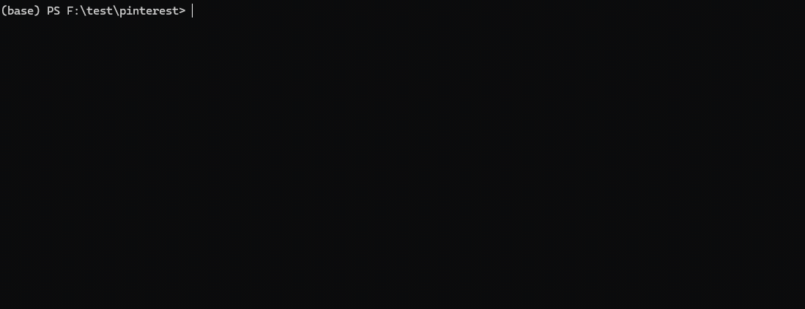
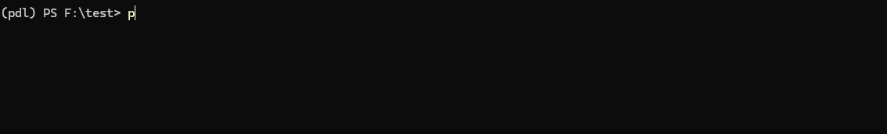
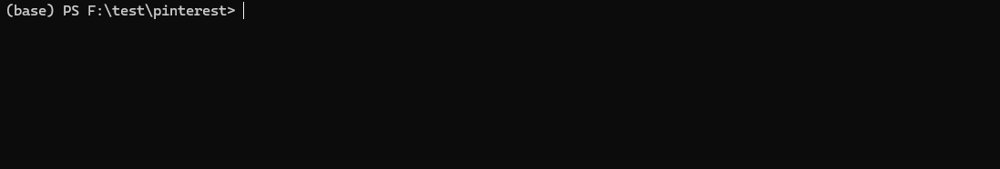
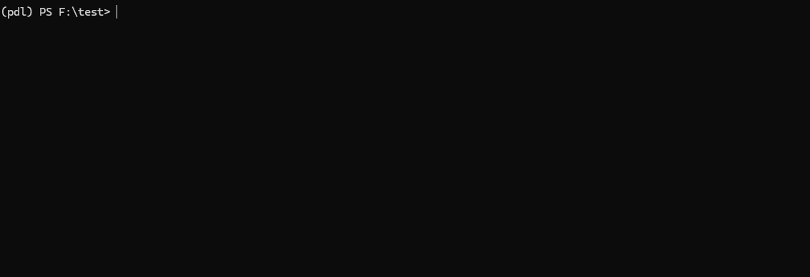

# CLI Usage Guide

## General Command Structure
```bash
pinterest-dl [command] [options]
```

| Command                   | Description                                                                        |
| ------------------------- | ---------------------------------------------------------------------------------- |
| [`login`](#1-login)       | Login to Pinterest to obtain browser cookies for scraping private boards and pins. |
| [`scrape`](#2-scrape)     | Download a pin (plus related pins), or scrape a board/section URL.                 |
| [`search`](#3-search)     | Search for images on Pinterest using a query.                                      |
| [`download`](#4-download) | Download images from a list of URLs provided in a JSON file.                       |


---

## Commands

### 1. Login  
Authenticate to Pinterest and save browser cookies for private boards/pins.

```bash
# Recommended - reads cookies from your already-installed Firefox (no extra deps):
pinterest-dl login --from-browser -o cookies.json

# Alternative - automated login via Playwright (requires: pip install pinterest-dl[browser]):
pinterest-dl login -o cookies.json
```



| Options                                     | Description                                                                 | Default        |
| ------------------------------------------- | --------------------------------------------------------------------------- | -------------- |
| `-o`, `--output [file]`                     | Path to save cookies file                                                   | `cookies.json` |
| `--from-browser`                            | Read cookies from your installed Firefox browser (no Playwright required)   | -              |
| `--client [chromium/firefox]`               | Playwright browser to use for automated login (requires `[browser]` extra)  | `chromium`     |
| `--headful`                                 | Show browser window (Playwright only)                                       | -              |
| `--incognito`                               | Use incognito mode (Playwright only)                                        | -              |
| `--verbose`                                 | Enable debug output                                                         | -              |

> [!NOTE]
> **No Playwright installed?** Use `--from-browser` to extract cookies from your existing Firefox installation -- no extra packages needed. Chromium-based browsers (Chrome, Edge) are not supported for `--from-browser` due to OS-level cookie encryption.
>
> **Want automated login?** Install the browser extra first: `pip install pinterest-dl[browser] && playwright install chromium`. Then run `pinterest-dl login` without `--from-browser`.


---

### 2. Scrape  
Download a pin (and related pins to fill `-n`), or scrape a Board/Section URL.

```bash
# Single or multiple URLs:
pinterest-dl scrape <url1> <url2> ...

# A single pin (returns the pin itself):
pinterest-dl scrape <pin_url>

# A pin plus related pins (pin + 4 related = 5 total):
pinterest-dl scrape <pin_url> -n 5

# Only related pins, excluding the pin itself:
pinterest-dl scrape <pin_url> -n 5 --related-only

# From one or more files (one URL per line):
pinterest-dl scrape -f urls.txt [options]
pinterest-dl scrape -f urls1.txt -f urls2.txt [options]

# From stdin:
cat urls.txt | pinterest-dl scrape -f - [options]
```


| Options                                     | Description                                               | Default        |
| ------------------------------------------- | --------------------------------------------------------- | -------------- |
| `-f`, `--file [file]`                       | Path to file with URLs (one per line); use `-` for stdin  | -              |
| `<url>`                                     | One or more Pinterest URLs                                | -              |
| `-o`, `--output [directory]`                | Directory to save images (stdout if omitted)              | -              |
| `-c`, `--cookies [file]`                    | Path to cookies file (for private content)                | `cookies.json` |
| `-n`, `--num [number]`                      | Images to download. For a pin URL, returns the pin plus related pins to reach this count | `1` for pins, `100` for boards/sections |
| `--related-only`                            | For a pin URL, download only related pins (exclude the pin itself); ignored for boards/sections | -        |
| `-r`, `--resolution [WxH]`                  | Minimum image resolution (e.g. `512x512`)                 | -              |
| `--video`                                   | Download video stream (if available)                      | -              |
| `--skip-remux` (**NEW**)                    | Skip ffmpeg remux, output raw .ts file (no ffmpeg needed) | -              |
| `--timeout [seconds]`                       | Request timeout                                           | `10`           |
| `--delay [seconds]`                         | Delay between requests                                    | `0.2`          |
| `--cache [path]`                            | Save scraped URLs to JSON                                 | -              |
| `--caption [txt/json/metadata/none]`        | Caption format: `txt`, `json`, `metadata`, or `none`      | `none`         |
| `--ensure-cap`                              | Require alt text on every image                           | -              |
| `--cap-from-title`                          | Use image title as caption                                | -              |
| `--dump [PATH]` (**NEW**)                   | Dump API requests/responses to PATH (default: `.dump`)    | -              |
| `--client [api/chromium/firefox]`           | Scraper backend                                           | `api`          |
| `--headful`                                 | Show browser window (browser clients only)                | -              |
| `--incognito`                               | Use incognito mode (browser clients only)                 | -              |
| `--json` (**NEW**)                          | Print structured JSON to stdout instead of human-readable output | -       |
| `--verbose`                                 | Enable debug output                                       | -              |

> [!TIP]
> For a pin URL, `scrape` returns the pin itself and fills the rest of `-n` with related pins. Pass `--related-only` to skip the pin and download recommendations alone.

---

### 3. Search  
Find and download images via a search query (API mode only), or from URL-lists in files.

```bash
# Simple query:
pinterest-dl search <query1> <query2> ... [options]

# From one or more files:
pinterest-dl search -f queries.txt [options]
pinterest-dl search -f q1.txt -f q2.txt [options]

# From stdin:
cat queries.txt | pinterest-dl search -f - [options]
```



| Options                              | Description                                                 | Default        |
| ------------------------------------ | ----------------------------------------------------------- | -------------- |
| `-f`, `--file [file]`                | Path to file with queries (one per line); use `-` for stdin | -              |
| `<query>`                            | One or more search terms                                    | -              |
| `-o`, `--output [directory]`         | Directory to save images (stdout if omitted)                | -              |
| `-c`, `--cookies [file]`             | Path to cookies file                                        | `cookies.json` |
| `-n`, `--num [number]`               | Maximum images to download                                  | `100`          |
| `-r`, `--resolution [WxH]`           | Minimum image resolution                                    | -              |
| `--video`                            | Download video stream (if available)                        | -              |
| `--skip-remux` (**NEW**)             | Skip ffmpeg remux, output raw .ts file (no ffmpeg needed)   | -              |
| `--timeout [seconds]`                | Request timeout                                             | `10`           |
| `--delay [seconds]`                  | Delay between requests                                      | `0.2`          |
| `--cache [path]`                     | Save results to JSON                                        | -              |
| `--caption [txt/json/metadata/none]` | Caption format                                              | `none`         |
| `--ensure-cap`                       | Require alt text on every image                             | -              |
| `--cap-from-title`                   | Use image title as caption                                  | -              |
| `--dump [PATH]` (**NEW**)            | Dump API requests/responses to PATH (default: `.dump`)      | -              |
| `--json` (**NEW**)                   | Print structured JSON to stdout instead of human-readable output | -         |
| `--verbose`                          | Enable debug output                                         | -              |

---

### 4. Download  
Fetch images from a previously saved cache file.

```bash
pinterest-dl download <cache.json> [options]
```


| Options                              | Description                                               | Default             |
| ------------------------------------ | --------------------------------------------------------- | ------------------- |
| `-o`, `--output [dir]`               | Directory to save images                                  | `./<json_filename>` |
| `-r`, `--resolution [WxH]`           | Minimum image resolution                                  | -                   |
| `--video`                            | Download video stream (if available)                      | -                   |
| `--skip-remux` (**NEW**)             | Skip ffmpeg remux, output raw .ts file (no ffmpeg needed) | -                   |
| `--caption [txt/json/metadata/none]` | Caption format                                            | `none`              |
| `--ensure-cap`                       | Require alt text on every image                           | -                   |
| `--json` (**NEW**)                   | Print structured JSON to stdout instead of human-readable output | -            |
| `--verbose`                          | Enable debug output                                       | -                   |

---

### JSON output (`--json`)

`scrape`, `search`, and `download` accept `--json` for machine-readable output. When set:

- Human-readable text is suppressed; a single JSON object is written to stdout on completion.
- Errors are written to stderr as `{"error": <message>}`, so stdout stays clean for piping.
- Without `-o`/`--output`, no files are downloaded -- only metadata is returned. With `--output`, files are downloaded and each item gains a `local_path`.
- `--cache` still writes the cache file in JSON mode.

Output shape:

```jsonc
// scrape / search
{"command": "scrape", "results": [{"input": "<url>", "items": [ ... ]}]}

// download
{"command": "download", "input": "cache.json", "items": [ ... ]}
```

```bash
# Pipe scraped metadata into jq without downloading anything
pinterest-dl scrape "<pin_url>" -n 10 --json | jq '.results[0].items[].src'
```
